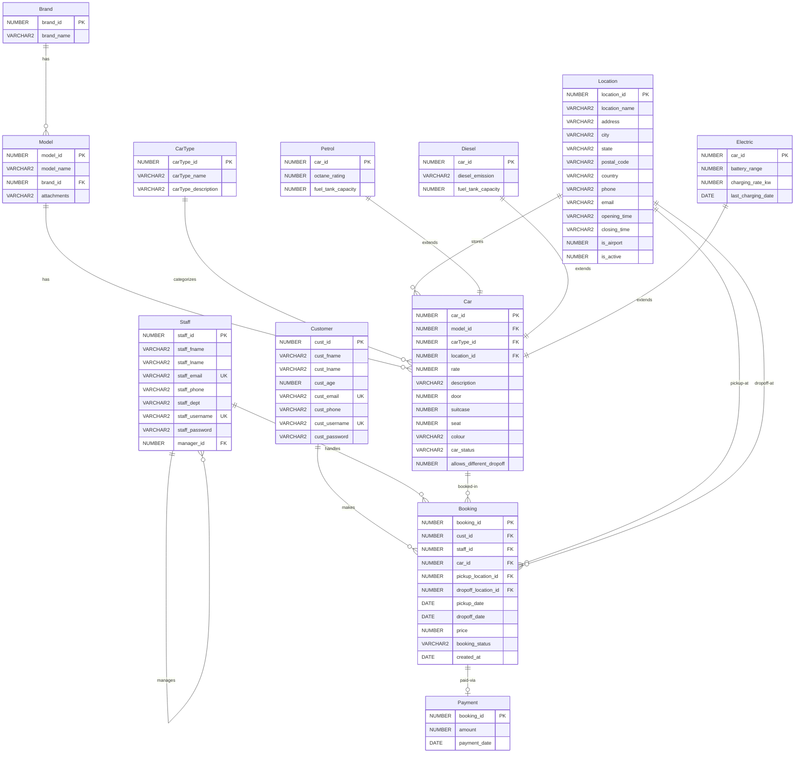

# Carola Car Rental - Entity Relationship Diagram

## ERD Diagram

## Table Summary

| Table | Description | Key Relationships |
|-------|-------------|-------------------|
| **Brand** | Car manufacturers (Toyota, Honda, etc.) | → Model |
| **CarType** | Vehicle categories (Sedan, SUV, etc.) | → Car |
| **Customer** | Registered customers | → Booking |
| **Staff** | Employees (self-referencing for managers) | → Booking, → Staff |
| **Model** | Car models with shared image | ← Brand, → Car |
| **Location** | Branch locations (airports, city centers) | → Car, → Booking |
| **Car** | Physical car units (fleet inventory) | ← Model, ← CarType, ← Location |
| **Petrol** | Petrol car specifications | ← Car (inheritance) |
| **Diesel** | Diesel car specifications | ← Car (inheritance) |
| **Electric** | Electric car specifications | ← Car (inheritance) |
| **Booking** | Rental reservations | ← Customer, ← Staff, ← Car, ← Location |
| **Payment** | Payment records (1:1 with Booking) | ← Booking |

## Key Features

### 🚗 Fleet Inventory System
- **One Model → Many Cars**: Same car model can have multiple physical units
- **Car ↔ Location**: Each car unit is assigned to one home location
- **Independent Availability**: Renting a car at KLIA doesn't affect the same model at Penang

### 📍 Location Management
- Supports airports (24-hour) and city branches
- Flexible pickup/dropoff locations
- `allows_different_dropoff` flag per car

### 🔋 Fuel Type Inheritance {Mandatory, Or}
**Disjoint Mandatory Specialization**: Every Car MUST be exactly ONE of:
- **Petrol**: octane_rating, fuel_tank_capacity
- **Diesel**: diesel_emission, fuel_tank_capacity  
- **Electric**: battery_range, charging_rate_kw, last_charging_date

> ⚠️ Note: Mermaid ERD cannot display the UML triangle notation. The `||--||` relationships indicate 1:1 mandatory from subtypes to Car.

### 📊 Status Tracking
- **Car Status**: Available, Rented, Maintenance, Dirty
- **Booking Status**: Confirmed, In Progress, Completed, Cancelled

### 🖼️ Image Management
- Images stored at **Model level** (not Car level)
- All cars of same model share one image

